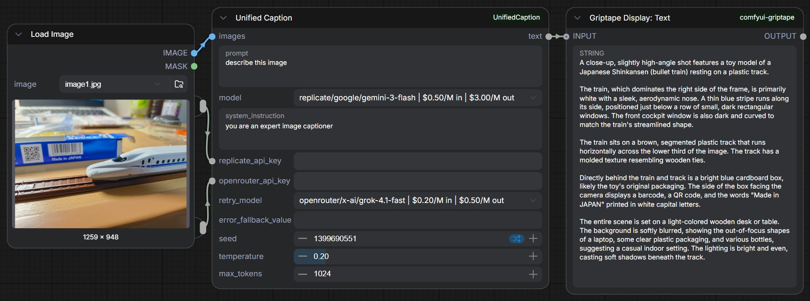

# ComfyUI Unified Caption Node

Unified multimodal captioning node for ComfyUI with OpenRouter and Replicate support.

## Example Workflow

  

  Example ComfyUI workflow showing image caption generation using the Unified Caption node.

A custom **ComfyUI node** for **single-image captioning using frontier multimodal AI models** through **OpenRouter** and **Replicate** APIs.

This node provides a **unified interface** for multiple vision-language models, allowing users to caption images without dealing with provider-specific API differences. It also includes **runtime cost estimation, automatic model fallback, retry control, and flexible prompt configuration**.

The node is designed primarily for **interactive captioning workflows**, where a user analyzes or describes an image and optionally regenerates alternate captions.

---

# Features

- Unified interface for **OpenRouter and Replicate multimodal models**
- Supports models such as **Gemini, Grok, and GPT vision models**
- Automatic **fallback model retry**
- **Cost estimation per request** using token usage
- **Seed parameter to force reruns** in ComfyUI
- Automatic **image resizing to reduce API cost**
- Lightweight design for **single-image caption workflows**

---

# Supported Model Providers

The node currently supports models through:

## Replicate

Examples:

google/gemini-3-flash
google/gemini-2.5-flash
openai/gpt-5-mini

## OpenRouter

Examples:

google/gemini-2.5-flash
google/gemini-3-flash-preview
x-ai/grok-4.1-fast
openai/gpt-5-mini

Each model entry includes **input/output token pricing**, which allows the node to estimate the runtime cost of each request.

Example model entry:

replicate/google/gemini-3-flash | $0.50/M in | $3.00/M out

---

# Node Overview

**Node Name:**  
Unified Caption

**Category:**  
Unified Caption

**Input:**

- Image
- Prompt
- Model selection
- Optional API parameters

**Output:**

- Generated caption text

---

# Inputs

## Prompt

Text instruction describing what the model should generate.

Example:

Describe the image in detail including objects, setting, lighting, and composition.

This prompt is sent directly to the selected multimodal model.

---

## Model

Selects which multimodal model will be used for caption generation.

Example entries:

replicate/google/gemini-3-flash
openrouter/x-ai/grok-4.1-fast

Each entry also includes token pricing information used for cost estimation.

Example:

replicate/google/gemini-3-flash | $0.50/M in | $3.00/M out

---

## Images

Image input from a ComfyUI image pipeline.

Only the **first image in the batch** is processed.

The node automatically converts the image to JPEG and encodes it before sending it to the API.

---

# Image Preprocessing

Before sending the image to the selected API, the node performs automatic preprocessing.

### Steps performed:

- Images larger than **1024 pixels on the longest side** are resized.
- The original **aspect ratio is preserved**.
- Resizing uses **LANCZOS high-quality resampling**.
- Images are converted to **JPEG format (quality 85)**.
- The image is encoded as a **Base64 data URL**.

### Example behavior

4096 × 4096 → resized to 1024 × 1024
4000 × 2000 → resized to 1024 × 512
800 × 800 → no resizing applied

This preprocessing reduces **API cost and latency** while preserving sufficient visual detail for most multimodal models.

---

# Optional Inputs

## System Instruction

Optional system-level instruction sent to the model.

This can guide the style of the caption.

Example:

You are a professional image captioning system that produces clear and detailed descriptions.

---

## Replicate API Key

API key used for Replicate models.

If left empty, the node will check the environment variable:

REPLICATE_API_TOKEN

---

## OpenRouter API Key

API key used for OpenRouter models.

If left empty, the node will check the environment variable:

OPENROUTER_API_KEY

---

## Retry Model

Optional fallback model.

If the primary model fails, the node automatically retries using this model.

This improves robustness when APIs temporarily fail.

---

## Error Fallback Value

Optional text returned if all model calls fail.

If not provided, the node will raise an error.

---

## Seed

This parameter **does not control model randomness**.

Frontier multimodal models do not expose a seed parameter.

Instead, this value is used to **force ComfyUI to re-execute the node**, bypassing graph caching.

Changing the seed allows the user to generate **alternate captions** for the same image.

---

## Temperature

Controls randomness of the language model output.

Typical values:

0.0 → deterministic output
0.2 → low variation
0.7+ → more creative descriptions

---

## Max Tokens

Maximum number of tokens the model can generate.

Default:

1024

---

# Output

## Text

The generated caption returned by the model.

This output can be connected to:

- Text Display nodes
- Logging nodes
- Prompt analysis tools
- Dataset preparation workflows

---

# Cost Estimation

After each request, the node logs estimated API cost in the console.

Example output:

Unified Node: Attempting replicate/google/gemini-3-flash
[COST] $0.001277 | model=google/gemini-3-flash
Unified Node: Success with google/gemini-3-flash
Prompt executed in 10.19 seconds

Cost is calculated using:

(input_tokens / 1,000,000 × input_price)

(output_tokens / 1,000,000 × output_price)

Token usage is extracted from API metrics when available.

---

# Example Workflow

Typical ComfyUI workflow:

Load Image
↓
Unified Caption
↓
Text Display

Modify the prompt or seed to regenerate alternate captions.

---

# Installation

Navigate to your ComfyUI custom nodes directory:

cd ComfyUI/custom_nodes

Clone the repository:

git clone https://github.com/tardigrade1001/ComfyUI-Unified-Caption

Restart ComfyUI.

---

# Requirements

Python dependencies:

requests
Pillow

Install them with:

pip install -r requirements.txt

---

# API Key Setup

You can either enter API keys directly in the node fields or use environment variables.

Example:

export OPENROUTER_API_KEY="your_key_here"
export REPLICATE_API_TOKEN="your_key_here"

---

# Design Goals

This node is designed for:

- Interactive image captioning
- Prompt reconstruction
- Visual analysis
- Lightweight experimentation

It is **not intended for large-scale batch captioning**, but for fast experimentation with individual images.

---

# Acknowledgements

Parts of this project were developed with assistance from AI tools, including OpenAI ChatGPT and Google Gemini, which were used for brainstorming, debugging, and code refinement.

The overall design, implementation, and integration of the node were carried out by the repository author.

---

# License

MIT License